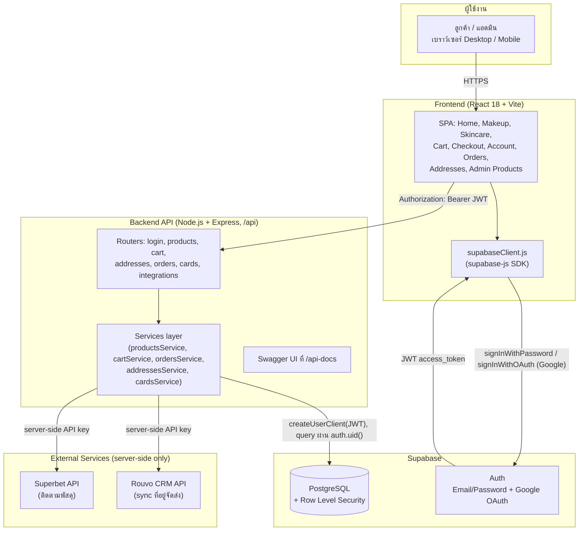
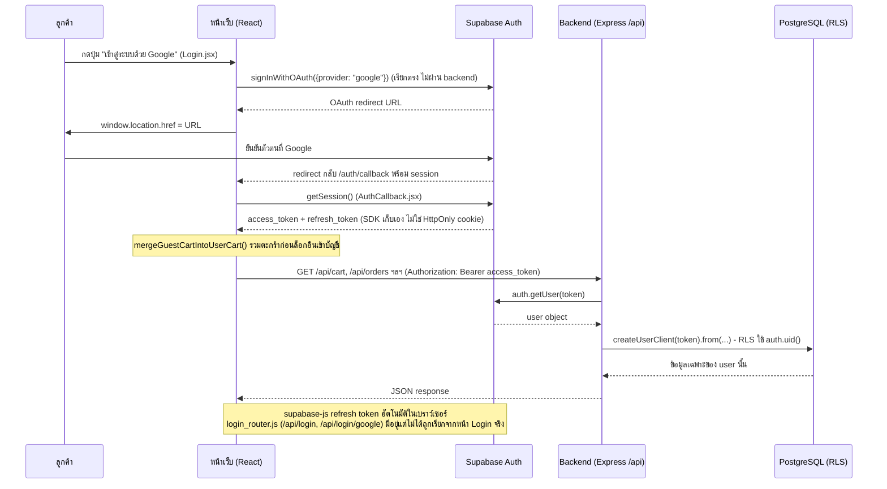
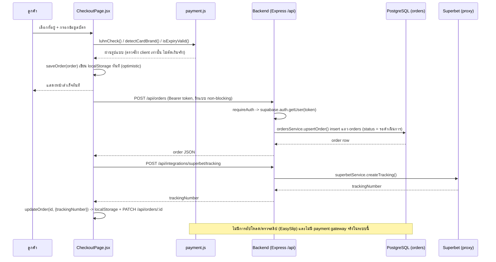
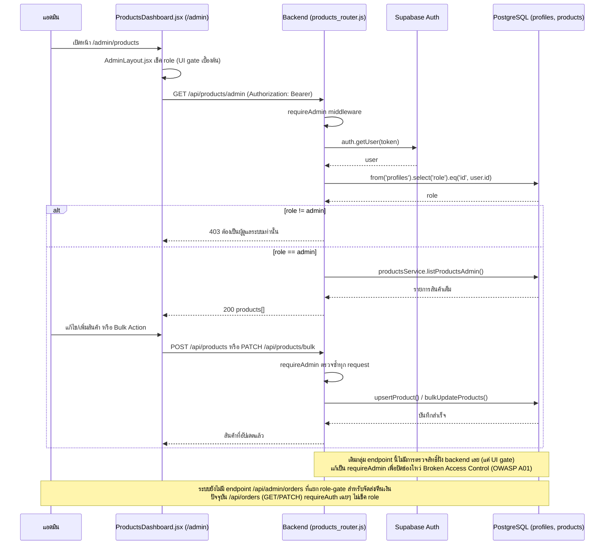

# System Architecture

## หมายเหตุ

- Payment เป็นการจำลองฝั่ง client (`frontend/src/payment.js`) ตรวจ Luhn/brand/expiry เท่านั้น ไม่มี payment gateway จริง (Omise/Stripe/2C2P) และไม่มีการตัดเงินจริง — เก็บแค่ brand + เลข 4 ตัวท้าย
- `login_router.js` มี endpoint `/login`, `/login/google` ฝั่ง backend ด้วย แต่ที่ใช้งานจริงในหน้า Login คือเรียก `supabase.auth.signInWithOAuth` ตรงจาก frontend
- Rouvo/Superbet ก่อนหน้านี้เคยเรียกจาก frontend ตรงๆ (คีย์หลุดใน bundle) ตอนนี้ย้ายมาเรียกจาก backend แล้ว

---

## Sequence Diagrams

แผนภาพลำดับการทำงานของแต่ละ flow หลัก อ้างอิงจากโค้ดจริงในระบบ (ไม่ใช่การออกแบบในอุดมคติ) — ดูหมายเหตุท้ายแต่ละแผนภาพสำหรับข้อจำกัด/ช่องว่างที่ยังไม่ได้ทำ

### 6.1 การเข้าสู่ระบบ + จัดการ Session

### 6.2 การสั่งซื้อ + ชำระเงิน (จำลอง)

### 6.3 แอดมินจัดการสินค้า

